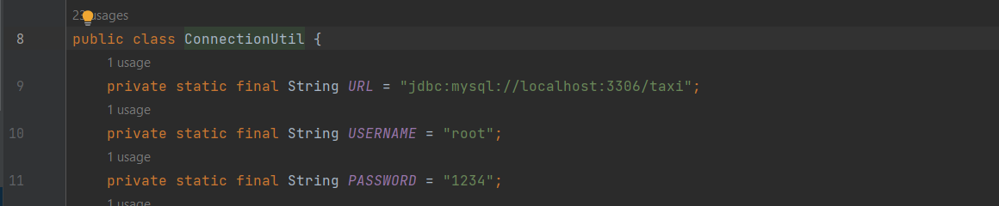
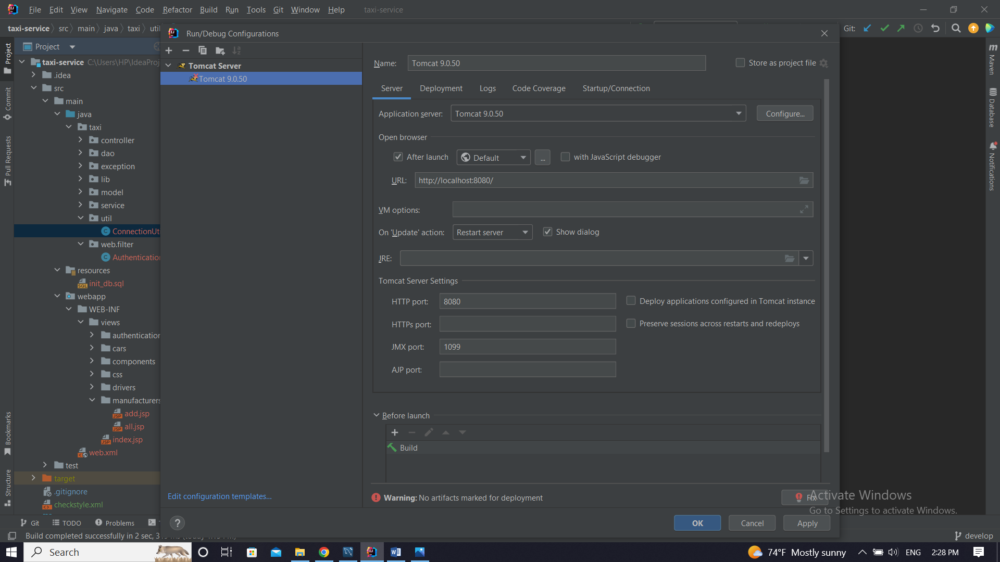
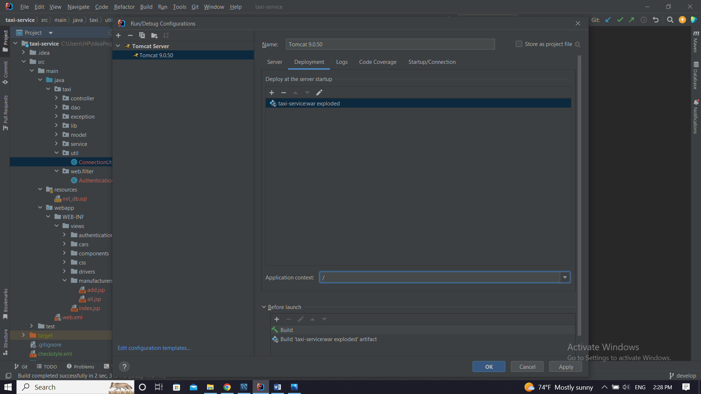

# 🚖 Taxi Service 🚖

This project is a system for managing cars, drivers, and manufacturers in a taxi service. It provides functionality for creating, updating, and deleting cars, drivers, and manufacturers, as well as retrieving information about them. The project follows a three-tier architecture with separate layers for the controller, service, and data access objects (DAO)

# ⚡️ Functionality
Taxi service offers the following functionality:

* Car management: Creating, updating, and deleting cars, retrieving a list of all cars, and retrieving cars by driver.

* Driver management: Creating, updating, and deleting drivers, retrieving a list of all drivers, and finding a driver by login.

* Manufacturer management: Creating, updating, and deleting manufacturers, retrieving a list of all manufacturers.

# 📝 Project Structure
The project follows a three-tier architecture with the following structure:

* Controller: Handles incoming requests from user and invokes the appropriate service methods.

* Service: Implements the business logic of the application and interacts with the DAO layer.

* DAO: Transfers requests from the service layer to the database, and executes SQL queries.

# 🧬 Technologies Used
* Java 17
* Apache Tomcat 9.0.50
* MySQL 8.0.28
* Maven 3.1.1
* Java Servlet 4.0.1
* JSP and CSS
* JSTL 1.2
* JDBC

# 🚀 Instructions for project running
To run the Taxi Service project, follow these steps:

1. Clone this project 

 
2. Set up a MySQL database and create new schema using script from init_db_sql file

3. In the ConnectionUtil class fill with the appropriate info following fields to create connection with database:
   
* url: The URL of your database, including host, port, db name and additional parameters.

* username: your accessing username
   
* password: your accessing password
  

4. To deploy this project you need to install Apache Tomcat web server. It's better to use 9.0.50 version which you can download [here](https://tomcat.apache.org/download-90.cgi). After installation, you can set up necessary configurations and fix Tomcat by selecting the artifact to deploy taxi-service:war exploded. It's also better to remove the Application context taxi_service_war exploded to /

5. Start Tomcat and application's login page should appear. Once logged in, you should be able to access different features of the application

